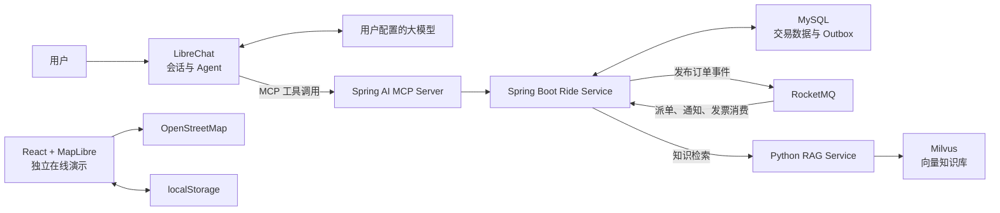
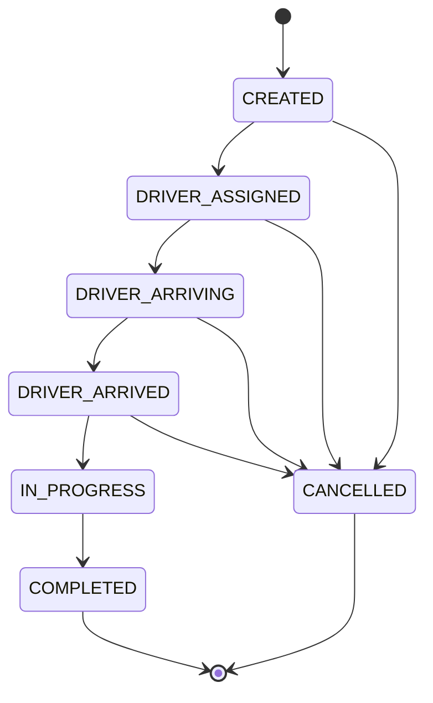

# 嘻嘻出行（Xixi Travel Agent）

一个面向网约车场景的智能出行 Agent 项目。用户可以用自然语言提出出行需求，Agent 根据任务自主调用知识检索、车型询价、创建订单、查询状态、取消订单、通知查询和发票资格查询等 MCP 工具。

项目重点不是复刻真实网约车平台，而是实现一条可运行、可解释的 Agent 业务链路：

- 使用 LibreChat 承载用户、会话、模型接入和 Agent 对话。
- 使用 Spring AI MCP 将出行业务能力封装为模型可调用工具。
- 使用 Spring Boot、MySQL 实现报价、订单、状态机、权限与幂等控制。
- 使用 RocketMQ 和 Transactional Outbox 异步处理模拟派单、超时取消、通知和发票资格。
- 使用 sentence-transformers、Milvus 构建出行领域 RAG 知识库。
- 提供 React + MapLibre 的独立交互演示，方便直接查看产品效果。


## 在线体验

- 在线演示：[https://yinpeng04.github.io/xixi-travel-agent/](https://yinpeng04.github.io/xixi-travel-agent/)
- GitHub 仓库：[https://github.com/YINPENG04/xixi-travel-agent](https://github.com/YINPENG04/xixi-travel-agent)

在线演示是纯前端版本，无需登录或配置模型密钥。它支持路线地图、车型报价、模拟叫车、接驾倒计时、行程记录和发票登记，数据只保存在当前浏览器的 `localStorage` 中，不会创建真实订单或发送发票。

> 在线演示与完整 Agent 后端目前相互独立。真实业务规则、MCP 工具、MySQL、RocketMQ 和 RAG 链路位于本仓库后端服务中。

## 核心技术选型

| 模块 | 技术 | 在项目中的作用 |
|---|---|---|
| Agent 入口 | LibreChat | 用户登录、会话管理、模型接入和 MCP 工具调用 |
| MCP 工具服务 | Spring AI 1.0.1 | 将 Java 业务方法注册为 Agent 可调用工具 |
| 业务后端 | Java 21、Spring Boot 3.4.5 | 报价、订单、状态机、权限校验和事务编排 |
| 交易数据库 | MySQL 8.4、Spring Data JPA、Flyway | 持久化报价快照、订单、幂等键、Outbox 和消费记录 |
| 消息队列 | RocketMQ 5.5、RocketMQ Spring 2.3.5 | 延迟派单、超时检查、异步通知、重试和死信处理 |
| RAG 知识库 | Python、sentence-transformers、Milvus 2.5 | 出行知识向量化、语义检索和回答依据召回 |
| 交互演示 | TypeScript、React 19、MapLibre GL JS | 地图、车型报价卡、订单状态和行程界面 |
| 本地编排 | Docker Compose | 统一启动 Agent、业务服务、消息队列和知识库依赖 |

MongoDB、Redis 和 Meilisearch 用于支撑 LibreChat 自身的用户、会话、缓存和检索能力，没有作为嘻嘻出行业务后端的技术亮点。Milvus 所依赖的 etcd 和 MinIO 也只作为向量数据库运行组件使用。

## 系统架构



### Agent 调用链路

1. 用户在 LibreChat 中描述出发地、目的地或咨询出行规则。
2. 大模型判断任务类型，需要领域知识时先调用 `travelKnowledgeSearch`。
3. 需要叫车时，Agent 调用 `rideQuote` 获取车型报价。
4. 用户确认后，Agent 使用报价 ID 和幂等键调用 `rideCreate`。
5. Spring Boot 在一个 MySQL 事务中写入订单和 Outbox 事件。
6. RocketMQ 异步触发模拟派单、超时检查和用户通知。
7. Agent 继续调用状态或通知工具，将异步处理结果反馈给用户。

## Agent 与 MCP 工具

路径：`services/ride-service/src/main/java/cn/xixitravel/ride/mcp/`

| 工具 | 功能 | 关键约束 |
|---|---|---|
| `travelKnowledgeSearch` | 检索地点、车型、规则、安全和发票知识 | 检索结果只作为回答依据 |
| `rideQuote` | 生成轻享、舒适、六座三类车型报价 | 创建订单前必须先询价 |
| `rideCreate` | 使用有效报价创建订单 | 需要用户确认和幂等键 |
| `rideStatus` | 查询订单当前状态 | 校验订单所属用户 |
| `rideCancel` | 取消尚未开始的订单 | 需要用户确认并校验状态 |
| `rideNotifications` | 查询异步派单、取消和完成通知 | 校验订单所属用户 |
| `rideInvoiceEligibility` | 查询完成行程的发票申请资格 | 完成事件消费后生成 |

Spring AI 将上述 Java 方法注册为同步 MCP 工具，并通过 SSE 暴露给 LibreChat。工具描述中约束 Agent 在创建和取消订单前取得用户确认，业务服务负责校验报价、用户、订单状态和幂等键。

## 业务后端设计

路径：`services/ride-service/`

### 报价与订单

- 报价根据基础价、里程单价和车型倍率计算，有效期为 5 分钟。
- 创建订单必须携带 `Idempotency-Key`。
- MySQL 使用“用户 ID + 幂等键”唯一索引防止重复下单。
- 查询、取消和异步结果查询都会校验订单所属用户。
- 参数错误和业务异常使用 RFC 9457 `ProblemDetail` 返回。

### 订单状态机



状态更新使用数据库悲观行锁和版本字段控制并发。`COMPLETED`、`CANCELLED` 为终态，非法状态迁移会被拒绝。

## RocketMQ 事件驱动链路

路径：`services/ride-service/src/main/java/cn/xixitravel/ride/messaging/`

创建订单时，业务事务同时写入订单数据、`ORDER_CREATED` 和 `ORDER_TIMEOUT_CHECK` Outbox 事件。定时发布器读取待发送事件并投递到 RocketMQ：

- 派单消费者延迟处理新订单，仅将仍为 `CREATED` 的订单推进到 `DRIVER_ASSIGNED`。
- 超时检查消费者只取消仍未派单的订单，不覆盖后续合法状态。
- 通知消费者保存派单、取消和完成消息。
- 发票消费者在行程完成后生成一次发票申请资格。
- 消费者使用“消费者名称 + 事件 ID”唯一记录实现幂等。
- 发布失败采用指数退避；消费失败由 RocketMQ 重试，超过次数进入死信队列。

该实现使用 Transactional Outbox 处理 MySQL 与 RocketMQ 的双写一致性：订单和待发送事件一起提交。即使消息发送成功后 Outbox 状态更新失败，重复投递也会由消费幂等记录拦截。

## RAG 知识检索

路径：`knowledge/`

知识样例覆盖地点别名、车型说明、报价规则、安全要求和发票政策。

1. `seed_milvus.py` 使用 `paraphrase-multilingual-MiniLM-L12-v2` 生成归一化向量。
2. PyMilvus 将知识片段写入 Milvus，并创建 HNSW/COSINE 索引。
3. `rag_service.py` 将用户问题向量化并召回相似片段。
4. Spring Boot 将检索结果封装为 REST API 和 `travelKnowledgeSearch` MCP 工具。
5. Agent 根据召回证据生成回答；没有匹配内容时明确说明知识库未命中。

RAG 只负责提供领域依据，不直接执行知识片段中的内容，也不参与订单写操作。

## 项目目录

```text
.
├─ app/                              React + MapLibre 在线演示
├─ services/ride-service/            Spring Boot 业务与 MCP 服务
│  └─ src/main/java/cn/xixitravel/ride/
│     ├─ api/                        REST 接口
│     ├─ domain/                     报价、订单与状态机
│     ├─ knowledge/                  RAG 客户端
│     ├─ mcp/                        MCP 工具
│     ├─ messaging/                  RocketMQ、Outbox 与幂等消费者
│     ├─ persistence/                JPA 实体与 Repository
│     └─ service/                    业务规则和事务编排
├─ services/rocketmq/                RocketMQ Broker 配置
├─ knowledge/                        RAG 服务、初始化脚本与知识数据
├─ scripts/bootstrap-librechat.ps1   LibreChat 固定基线检出脚本
├─ docker-compose.xixi.yml           完整本地环境编排
└─ librechat.xixi.yaml               LibreChat MCP 配置
```

## 快速体验

### 运行纯前端演示

环境要求：Node.js 22.13 或更高版本。

```bash
git clone https://github.com/YINPENG04/xixi-travel-agent.git
cd xixi-travel-agent
npm ci
npm run dev
```

浏览器访问 [http://localhost:3000](http://localhost:3000)。

### 启动完整 Agent 环境

环境要求：Git、PowerShell、Docker 和 Docker Compose。

```powershell
git clone https://github.com/YINPENG04/xixi-travel-agent.git
cd xixi-travel-agent
Copy-Item .env.example .env
powershell -ExecutionPolicy Bypass -File .\scripts\bootstrap-librechat.ps1
docker compose -f docker-compose.xixi.yml --profile librechat up --build
```

启动后：

- LibreChat：[http://localhost:3080](http://localhost:3080)
- Ride Service：[http://localhost:8081](http://localhost:8081)
- MCP SSE：[http://localhost:8081/sse](http://localhost:8081/sse)
- RAG Service：[http://localhost:8090](http://localhost:8090)

首次启动前请修改 `.env` 中的本地密码，并按照 LibreChat 上游说明配置自己的模型服务。仓库不包含大模型 API 密钥。

## REST API

| 方法 | 路径 | 功能 |
|---|---|---|
| `POST` | `/api/v1/knowledge/search` | 检索出行知识库 |
| `POST` | `/api/v1/quotes` | 生成车型报价 |
| `POST` | `/api/v1/rides` | 使用有效报价创建订单 |
| `GET` | `/api/v1/rides/{orderId}` | 查询订单状态 |
| `POST` | `/api/v1/rides/{orderId}/cancel` | 取消允许取消的订单 |
| `GET` | `/api/v1/rides/{orderId}/notifications` | 查询异步订单通知 |
| `GET` | `/api/v1/rides/{orderId}/invoice-eligibility` | 查询发票申请资格 |
| `PATCH` | `/api/v1/internal/rides/{orderId}/status/{status}` | 演示环境推进订单状态 |

除询价与知识检索外，订单接口通过 `X-Xixi-User` 请求头传递演示用户身份；创建订单还需要 `Idempotency-Key`。

## 测试

前端：

```bash
npm test
```

后端：

```bash
cd services/ride-service
mvn test
```

后端集成测试使用 H2 的 MySQL 兼容模式，覆盖报价与订单持久化、下单幂等、状态机、Outbox 写入、重复消费、超时取消、通知和发票资格生成。

## 当前边界

- 在线演示尚未连接 Spring Boot 后端，报价、路线和司机信息是前端演示数据。
- 项目没有接入真实地图路线规划、车辆调度、定位、支付、短信或发票开具服务。
- `X-Xixi-User` 是演示身份头，不是生产级认证方案。
- Agent 的操作确认目前依赖工具描述和编排规则，后端尚未使用独立确认令牌强制校验。
- RocketMQ 采用单 NameServer、单 Broker 的本地演示配置，不具备生产级高可用能力。
- RAG 使用项目内置知识样例，尚未实现知识版本管理、混合检索和重排序。

## 开源与许可证

- LibreChat 固定基线：`8e5ef1fb31e9d63b735c089b21cbc82c50acce46`，MIT License。
- Namma Yatri 仅作为网约车业务流程参考，本项目未复制或打包其源码。
- 地图数据来自 OpenStreetMap，界面保留相应署名。
- 第三方依赖和许可证见 [OPEN_SOURCE_USAGE.md](./OPEN_SOURCE_USAGE.md) 与 [THIRD_PARTY_NOTICES.md](./THIRD_PARTY_NOTICES.md)。

本项目用于学习、作品展示和 Agent 工程实践，不代表可直接投入生产的网约车系统。
