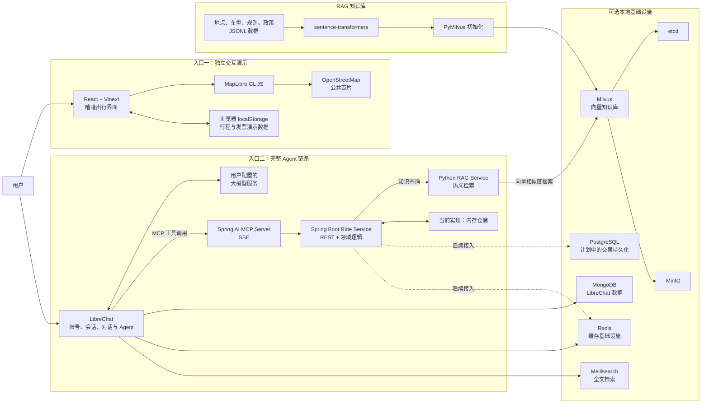
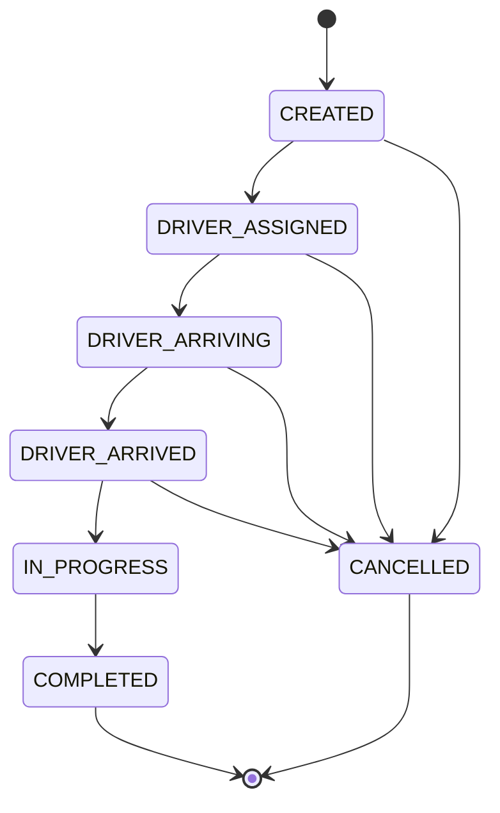

# 嘻嘻出行（Xixi Travel）

一句话，轻松出发。

嘻嘻出行是一个面向打车、路线规划和行程服务场景的智能出行 Agent 开源项目。项目包含可独立运行的 React/MapLibre 演示界面、基于 LibreChat 的 Agent 入口、Spring Boot 出行业务服务、Spring AI MCP 工具，以及基于 sentence-transformers 与 Milvus 的 RAG 知识检索链路。


## 在线体验

- 公开演示：[https://yinpeng04.github.io/xixi-travel-agent/](https://yinpeng04.github.io/xixi-travel-agent/)
- 源码仓库：[https://github.com/YINPENG04/xixi-travel-agent](https://github.com/YINPENG04/xixi-travel-agent)

## 直接体验基本功能

打开公开演示地址即可直接使用，无需登录、安装软件或配置模型密钥：

[进入嘻嘻出行在线演示 →](https://yinpeng04.github.io/xixi-travel-agent/)

| 功能 | 操作方式 |
|---|---|
| 路线规划 | 输入目的地或选择北京南站、首都机场等快捷地点 |
| 车型报价 | 切换轻享、舒适、六座，查看价格与预计接驾时间 |
| 模拟叫车 | 选择车型并确认，查看司机、车辆和接驾倒计时 |
| 行程管理 | 打开“行程”，查看当前订单和历史记录，可取消或完成演示行程 |
| 发票演示 | 完成行程后打开“发票”，登记抬头和接收邮箱 |
| 实时时间 | 页面顶部显示持续更新的北京时间 |

演示数据只保存在当前浏览器中，不会创建真实订单、扣款或发送发票邮件。

## 项目定位

本仓库同时提供两种使用方式：

1. **前端交互演示**：直接运行 `app/`，无需数据库、模型密钥或后端服务，即可体验地图、车型报价、叫车、司机倒计时、行程和发票页面。
2. **完整 Agent 链路**：启动 LibreChat、Spring Boot 和知识服务，由大模型通过 MCP 自主调用知识检索、询价、创建订单、查询状态和取消订单等工具。

两条路径目前彼此独立。在线演示界面的报价、路线和司机信息是前端演示数据，尚未直接调用 `ride-service`；真实业务规则和 MCP 工具位于 Spring Boot 服务中。

## 三分钟本地体验

本地界面不需要 ChatGPT 账号、地图密钥或后端服务。安装 Git 和 Node.js 22.13 或更高版本后执行：

```bash
git clone https://github.com/YINPENG04/xixi-travel-agent.git
cd xixi-travel-agent
npm ci
npm run dev
```

打开 [http://localhost:3000](http://localhost:3000)。

行程和发票演示数据保存在当前浏览器的 `localStorage` 中，不会上传到作者服务器。不同浏览器和设备的数据彼此独立，清除浏览器站点数据即可重置演示。

## 总体架构



## 分层说明

### 1. 交互展示层

路径：`app/`

技术栈：TypeScript、React 19、Vinext、MapLibre GL JS。

主要能力：

- 中文出行工作台、目的地输入和快捷地点。
- OpenStreetMap 底图、模拟路线、起终点标记。
- 轻享、舒适、六座三类车型报价卡。
- 叫车、司机接驾倒计时和演示行程完结。
- 行程列表、订单状态、电子发票登记。
- 北京时间实时更新。
- 通过 `localStorage` 保存当前设备的演示行程。

该层为了方便展示采用浏览器本地状态，不依赖 Spring Boot 服务。地图坐标、报价和司机数据为演示数据，不代表真实调度结果。

### 2. Agent 与会话层

项目以 LibreChat 作为对话、用户、会话、模型接入和 Agent/MCP 框架的固定基线：

- 上游仓库：`danny-avila/LibreChat`
- 固定提交：`8e5ef1fb31e9d63b735c089b21cbc82c50acce46`
- 检出脚本：`scripts/bootstrap-librechat.ps1`
- 嘻嘻配置：`librechat.xixi.yaml`

LibreChat 源码不直接提交到本仓库，而是检出到已忽略的 `vendor/LibreChat/`。完整模式下，LibreChat 通过 `http://ride-service:8081/sse` 连接嘻嘻出行 MCP 服务。

仓库不包含任何大模型 API 密钥。若要进行真实 Agent 对话，需要按照 LibreChat 上游说明配置自己的模型服务。

### 3. MCP 工具层

路径：`services/ride-service/src/main/java/cn/xixitravel/ride/mcp/`

Spring AI 将 Java 方法注册为 MCP 工具：

| 工具 | 用途 | 关键约束 |
|---|---|---|
| `travelKnowledgeSearch` | 检索地点别名、车型、规则、安全和发票知识 | 事实类问题优先调用；检索内容仅作回答依据 |
| `rideQuote` | 返回车型、预计接驾时间和报价 | 下单前必须先询价 |
| `rideCreate` | 使用有效报价创建订单 | 需要用户 ID、幂等键和用户确认 |
| `rideStatus` | 查询当前订单状态 | 按用户 ID 隔离订单 |
| `rideCancel` | 取消尚未开始的订单 | 调用前需要用户确认 |

MCP Server 使用同步工具模式，通过 SSE 对 LibreChat 提供能力。Agent 根据问题类型选择知识检索或交易工具；创建和取消订单前需要确认的要求目前写在 Agent/MCP 工具说明中，业务接口尚未通过独立的确认令牌强制校验。

### 4. 出行业务层

路径：`services/ride-service/`

技术栈：Java 21、Spring Boot 3.4.5、Spring AI 1.0.1。

核心规则：

- 报价有效期为五分钟。
- 报价按基础价、里程单价和车型倍率计算。
- 创建订单必须携带 `Idempotency-Key`。
- 幂等键按“用户 ID + 幂等键”隔离。
- 查询和取消订单时校验订单所属用户。
- 非法状态迁移会被拒绝。
- 参数错误和业务错误以 RFC 9457 `ProblemDetail` 返回。

当前订单、报价和幂等键保存在进程内的并发 Map 中，服务重启后会丢失。Docker Compose 虽然提供 PostgreSQL 和 Redis，但当前 Java 代码还没有将仓储接入它们。

### 5. 订单状态机



`COMPLETED` 和 `CANCELLED` 是终态，行程开始后不能通过现有接口取消。

### 6. 知识库层

路径：`knowledge/`

知识库样例包含：

- 地点名称和别名。
- 车型载客量和适用场景。
- 报价有效期。
- Agent 安全确认规则。
- 行程发票说明。

`seed_milvus.py` 使用 `sentence-transformers/paraphrase-multilingual-MiniLM-L12-v2` 生成归一化向量，通过 PyMilvus 创建 HNSW/COSINE 索引并写入 Milvus。`rag_service.py` 将用户问题转换为同一向量空间，在 Milvus 中检索相似片段，并返回标题、类别、正文和相似度分数。

Spring Boot 将检索能力同时暴露为 REST API 和 `travelKnowledgeSearch` MCP 工具。大模型负责判断何时检索，并结合返回片段生成最终回答，形成“检索增强生成”（RAG）闭环。检索为空时，Agent 被要求明确说明没有匹配资料，避免凭空补充项目规则。

初始化脚本默认按主键更新或插入知识数据；设置 `XIXI_RECREATE_COLLECTION=true` 时会先删除并重建 `xixi_travel_knowledge` 集合。该方式适合初始化和演示，不适合直接用于保存人工维护的生产数据。知识片段属于回答依据，不应被当作可执行指令。

### 7. 基础设施层

`docker-compose.xixi.yml` 提供以下容器：

| 服务 | 作用 | 当前接入状态 |
|---|---|---|
| `ride-service` | 报价、订单、REST API 和 MCP 工具 | 已接入 |
| `mongodb` | LibreChat 用户、会话和应用数据 | LibreChat 模式使用 |
| `meilisearch` | LibreChat 全文检索 | LibreChat 模式使用 |
| `redis` | LibreChat 缓存；计划承载业务幂等和短期状态 | 部分接入 |
| `postgres` | 计划存储订单、报价快照、行程和发票 | 容器已提供，业务代码未接入 |
| `knowledge-init` | 生成向量并初始化知识集合 | 首次启动时自动执行 |
| `knowledge-service` | 问题向量化、相似度检索和结果过滤 | REST 与 MCP 已接入 |
| `milvus` | 保存和检索知识向量 | RAG 链路已接入 |
| `etcd` | Milvus 元数据协调 | Milvus 使用 |
| `minio` | Milvus 对象存储 | Milvus 使用 |

根目录的 `db/`、`drizzle/` 和 `examples/d1/` 是站点运行环境预留的 D1/Drizzle 脚手架，当前嘻嘻出行业务没有使用 D1。

## 三条关键数据流

### 前端演示数据流

1. 用户在 React 页面输入目的地。
2. 前端根据内置数据展示路线和车型报价。
3. 用户确认叫车后，浏览器生成演示订单。
4. 倒计时、状态变化、行程和发票保存在 `localStorage`。
5. MapLibre 从 OpenStreetMap 公共瓦片服务加载地图。

该流程无需登录、后端和大模型，适合产品演示与前端开发。

### Agent 工具调用数据流

1. 用户登录本地 LibreChat 并提出出行需求。
2. 大模型理解出发地、目的地、里程和预计时间。
3. Agent 调用 `rideQuote` 获得三类车型报价。
4. 用户明确确认后，Agent 使用报价 ID 和幂等键调用 `rideCreate`。
5. Agent 使用 `rideStatus` 查询状态，或在确认后调用 `rideCancel`。
6. Spring Boot 服务负责报价有效期、用户隔离、幂等和状态迁移。

### RAG 知识问答数据流

1. 用户询问车型、地点、报价规则、安全要求或发票政策。
2. Agent 先调用 `travelKnowledgeSearch`，并将完整问题作为检索词。
3. Spring Boot 把请求转发给 Python 知识服务。
4. `sentence-transformers` 生成问题向量，Milvus 使用 HNSW/COSINE 检索相似知识片段。
5. 知识服务过滤低相关结果，返回结构化证据。
6. 大模型只结合检索结果和对话上下文生成自然语言回答。

## 项目目录

```text
.
├─ app/                          React/MapLibre 交互演示
│  ├─ XixiTravelApp.tsx          页面状态、地图、行程与发票交互
│  ├─ globals.css                视觉样式与响应式布局
│  ├─ layout.tsx                 页面元数据
│  └─ page.tsx                   首页入口
├─ services/ride-service/        Spring Boot 业务与 MCP 服务
│  ├─ src/main/java/.../api/     REST 接口和异常处理
│  ├─ src/main/java/.../domain/  报价、订单、车型和状态机
│  ├─ src/main/java/.../knowledge/ RAG 检索客户端与返回模型
│  ├─ src/main/java/.../mcp/     Spring AI MCP 工具
│  └─ src/main/java/.../service/ 业务规则和内存仓储
├─ knowledge/                    RAG 服务、Milvus 初始化脚本和知识样例
│  ├─ rag_service.py             FastAPI 语义检索服务
│  ├─ seed_milvus.py             知识向量化与集合初始化
│  └─ data/                      JSONL 知识数据
├─ scripts/                      LibreChat 固定基线检出脚本
├─ tests/                        前端构建产物测试
├─ worker/                       Vinext/Cloudflare Worker 入口
├─ docker-compose.xixi.yml       本地完整依赖编排
├─ librechat.xixi.yaml           LibreChat 与 MCP 配置
├─ OPEN_SOURCE_USAGE.md          开源归属与许可证说明
└─ THIRD_PARTY_NOTICES.md        第三方项目提示
```

## 本地运行

### 模式 A：只运行交互界面

要求：

- Node.js 22.13 或更高版本
- npm

```bash
npm ci
npm run dev
```

访问 [http://localhost:3000](http://localhost:3000)。

### 模式 B：只运行 Spring Boot 服务

要求：

- JDK 21 或更高版本
- Maven 3.9 或更高版本

```bash
cd services/ride-service
mvn test
mvn spring-boot:run
```

服务地址：

- REST API：`http://localhost:8081/api/v1`
- MCP SSE：`http://localhost:8081/sse`
- 健康检查：`http://localhost:8081/actuator/health`

### 模式 C：启动基础设施

复制环境变量样例：

```bash
cp .env.example .env
```

Windows PowerShell：

```powershell
Copy-Item .env.example .env
```

修改示例密码后启动：

```bash
docker compose -f docker-compose.xixi.yml up -d
```

### 模式 D：启动 LibreChat + MCP 完整链路

先检出固定 LibreChat 基线。

Windows PowerShell：

```powershell
.\scripts\bootstrap-librechat.ps1
```

macOS 或 Linux：

```bash
git clone --filter=blob:none --no-checkout https://github.com/danny-avila/LibreChat.git vendor/LibreChat
git -C vendor/LibreChat fetch --depth=1 origin 8e5ef1fb31e9d63b735c089b21cbc82c50acce46
git -C vendor/LibreChat checkout --detach 8e5ef1fb31e9d63b735c089b21cbc82c50acce46
```

然后根据 LibreChat 上游文档在 `.env` 中配置自己的模型服务，再启动：

```bash
docker compose -f docker-compose.xixi.yml --profile librechat up -d
```

访问 [http://localhost:3080](http://localhost:3080)，可在本机注册独立账号。账号和会话保存在本地 MongoDB 中，与在线演示站点互不相通。

### 启动 RAG 知识库

使用 Docker Compose 时，`knowledge-init` 会自动下载向量模型、重建知识集合并写入样例数据，随后启动 `knowledge-service`：

```bash
docker compose -f docker-compose.xixi.yml up -d knowledge-service ride-service
```

首次构建镜像和下载模型需要一些时间。知识服务就绪后可访问：

- 健康检查：`http://localhost:8090/health`
- 原始检索接口：`http://localhost:8090/api/v1/search`
- Spring Boot 检索接口：`http://localhost:8081/api/v1/knowledge/search`

如需在宿主机手动初始化或调试，先启动 Milvus 依赖：

```bash
docker compose -f docker-compose.xixi.yml up -d etcd minio milvus
```

安装 Python 依赖并写入样例数据：

macOS 或 Linux：

```bash
python -m venv .venv
source .venv/bin/activate
python -m pip install -r knowledge/requirements.txt
python knowledge/seed_milvus.py
uvicorn knowledge.rag_service:app --host 0.0.0.0 --port 8090
```

Windows PowerShell：

```powershell
python -m venv .venv
.\.venv\Scripts\Activate.ps1
python -m pip install -r knowledge/requirements.txt
python knowledge/seed_milvus.py
uvicorn knowledge.rag_service:app --host 0.0.0.0 --port 8090
```

首次运行会下载向量模型。可通过以下环境变量覆盖默认配置：

| 环境变量 | 默认值 | 说明 |
|---|---|---|
| `MILVUS_HOST` | `localhost` | Milvus 地址 |
| `MILVUS_PORT` | `19530` | Milvus 端口 |
| `XIXI_MILVUS_COLLECTION` | `xixi_travel_knowledge` | 集合名称 |
| `XIXI_EMBEDDING_MODEL` | `sentence-transformers/paraphrase-multilingual-MiniLM-L12-v2` | 向量模型 |
| `XIXI_RAG_MIN_SCORE` | `0.30` | 返回知识片段的最低余弦相似度 |
| `XIXI_KNOWLEDGE_BASE_URL` | `http://localhost:8090` | Spring Boot 访问知识服务的地址 |
| `XIXI_RECREATE_COLLECTION` | `false` | 初始化前是否删除并重建 Milvus 集合 |

## REST API

| 方法 | 路径 | 说明 |
|---|---|---|
| `POST` | `/api/v1/knowledge/search` | 语义检索出行知识库 |
| `POST` | `/api/v1/quotes` | 根据路线里程和时长生成车型报价 |
| `POST` | `/api/v1/rides` | 使用有效报价创建订单 |
| `GET` | `/api/v1/rides/{orderId}` | 查询当前用户的订单 |
| `POST` | `/api/v1/rides/{orderId}/cancel` | 取消允许取消的订单 |
| `PATCH` | `/api/v1/internal/rides/{orderId}/status/{status}` | 演示用内部状态推进接口 |

询价：

```bash
curl -X POST http://localhost:8081/api/v1/quotes \
  -H "Content-Type: application/json" \
  -d '{"origin":"故宫博物院","destination":"北京南站","distanceKilometers":12.6,"durationMinutes":28}'
```

创建订单：

```bash
curl -X POST http://localhost:8081/api/v1/rides \
  -H "Content-Type: application/json" \
  -H "X-Xixi-User: demo-user" \
  -H "Idempotency-Key: demo-order-001" \
  -d '{"quoteId":"Q-XXXXXXXX","origin":"故宫博物院","destination":"北京南站"}'
```

其中 `quoteId` 必须替换为询价接口返回、且尚未过期的报价 ID。

检索出行知识：

```bash
curl -X POST http://localhost:8081/api/v1/knowledge/search \
  -H "Content-Type: application/json" \
  -d '{"query":"行程完成后怎么开发票？","limit":3,"category":"invoice"}'
```

`category` 可省略，也可使用 `place_alias`、`vehicle`、`policy`、`safety` 或 `invoice`。Agent 调用 MCP 工具时默认跨类别返回最相关的三条知识。

## 测试与持续集成

前端构建和关键页面检查：

```bash
npm test
```

Spring Boot 测试：

```bash
cd services/ride-service
mvn test
```

`.github/workflows/ci.yml` 会在推送和 Pull Request 时运行 Web 测试、Java 测试和 RAG Python 语法检查。

## 部署说明

公开演示通过 `vite.github-pages.config.ts` 构建为纯静态前端，并由 GitHub Actions 自动发布到 GitHub Pages。该版本无需登录即可使用，但不运行 Java、LibreChat 或 MCP 后端。

仓库同时保留 Vinext/Cloudflare Worker 构建方式。`worker/index.ts` 是 Worker 入口，`build/sites-vite-plugin.ts` 在构建结束后打包站点元数据。

完整 Agent 链路包含 MongoDB、Redis、Meilisearch、Spring Boot、Milvus、etcd 和 MinIO，不等同于单页演示站点，需要使用 Docker Compose 或等价基础设施单独部署。

## 当前边界与生产化注意事项

- 当前系统是 MVP，不包含真实车辆调度、支付、短信、实名认证、定位上报或生产级风控。
- 前端演示界面尚未调用 Spring Boot REST/MCP 服务。
- 后端订单和报价使用内存仓储，服务重启后数据丢失。
- `X-Xixi-User` 是演示身份头，不是生产级认证机制。
- 内部状态推进接口当前没有独立鉴权，只适合受控演示环境。
- Agent 的“创建或取消前确认”主要依靠工具描述和编排规则，后端尚未强制验证确认凭证。
- 发票功能只在浏览器本地登记，不会生成真实发票或发送邮件。
- 当前 RAG 使用小规模样例知识和单路向量检索，尚未加入关键词混合检索、重排序、文档版本管理和回答引用界面。
- `librechat.xixi.yaml` 中的隐私政策和服务条款地址是占位地址，公开部署前必须替换。
- 公共 OpenStreetMap 瓦片服务不应被当作无配额、无保障的商业地图 CDN。
- 生产化时应将订单、报价快照、行程和发票写入 PostgreSQL，并将幂等键、报价有效期和短期状态迁移到 Redis 或兼容组件。

## 建议演进路线

1. 将前端报价、下单和行程页面接入 Spring Boot REST API。
2. 使用 PostgreSQL 实现订单、报价、行程和发票仓储。
3. 使用 Redis 或 Valkey 实现分布式幂等、报价 TTL 和短期状态。
4. 增加标准登录鉴权，将用户身份安全传递给 REST 和 MCP 工具。
5. 为 RAG 增加混合检索、重排序、知识版本管理和可视化引用。
6. 为重要操作增加可验证的确认令牌和审计日志。
7. 增加路线服务、地图供应商适配层和生产级限流。
8. 生成 SBOM、漏洞报告和第三方许可证清单。

## 开源项目与许可证

- 本仓库自行开发代码采用根目录 `LICENSE` 所示的 MIT License。
- LibreChat 使用 MIT License，并通过固定提交脚本检出。
- Namma Yatri 仅作业务流程和领域建模参考，未复制、修改或打包其源码。
- Redis 7.4、MongoDB 和 MinIO 的授权条件需要单独评估。
- OpenStreetMap 数据采用 ODbL，界面必须保留署名。

完整的代码归属、版本、许可证及分发边界见：

- [OPEN_SOURCE_USAGE.md](./OPEN_SOURCE_USAGE.md)
- [THIRD_PARTY_NOTICES.md](./THIRD_PARTY_NOTICES.md)

## 贡献

欢迎通过 Issue 或 Pull Request 提交改进。提交前请运行前端和 Java 测试；若引入第三方代码或资源，请同时记录来源、版本、修改内容和许可证。

## 免责声明

本项目仅用于技术研究、作品展示和架构验证，不提供真实网约车服务。仓库中的开源归属说明不构成法律意见。
