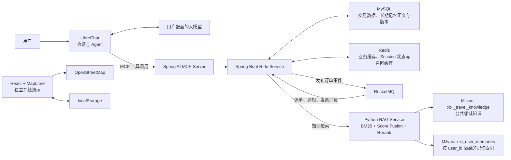

# 嘻嘻出行（Xixi Travel Agent）

一个面向网约车场景的智能出行 Agent 项目。用户可以用自然语言提出出行需求，Agent 根据任务自主调用知识检索、车型询价、创建订单、查询状态、取消订单、通知查询和发票资格查询等 MCP 工具。

- 使用 LibreChat 承载用户、会话、模型接入和 Agent 对话。
- 使用 Spring AI MCP 将出行业务能力封装为模型可调用工具。
- 通过有界 ReAct 循环组织“判断—工具执行—结果反馈”，让 RAG 证据和业务工具结果共同驱动下一步动作。
- 使用 Spring Boot、MySQL 和 Redis 实现报价、订单、缓存、状态机、数据归属与幂等控制。
- 将记忆按是否跨 Session 使用划分：LibreChat 管理当前会话上下文，Redis 保存短期任务状态；MySQL 保存用户确认的长期偏好，Milvus 提供按用户隔离的语义召回。
- 使用 RocketMQ 异步处理模拟派单、超时取消、通知和发票资格。
- 使用 Milvus 语义召回、BM25 关键词召回、加权分数融合和 CrossEncoder 精排构建出行领域 RAG 知识库。
- 提供 React + MapLibre 的独立交互演示，方便直接查看产品效果。

## 核心技术选型

| 模块 | 技术 | 在项目中的作用 |
|---|---|---|
| Agent 入口 | LibreChat | 用户登录、会话管理、模型接入和 MCP 工具调用 |
| MCP 工具服务 | Spring AI 1.0.1 | 将 Java 业务方法注册为 Agent 可调用工具 |
| 业务后端 | Java 21、Spring Boot 3.4.5 | 报价、订单、状态机、归属校验和事务编排 |
| 交易与记忆数据库 | MySQL 8.4、Spring Data JPA、Flyway | 持久化报价、订单、幂等键、长期用户偏好、Outbox 和消费记录 |
| 缓存与短期状态 | Redis 7.4、Spring Data Redis | 缓存报价、热点订单、记忆召回结果和当前 Session 任务状态 |
| 消息队列 | RocketMQ 5.5、RocketMQ Spring 2.3.5 | 延迟派单、超时检查、异步通知、重试和死信处理 |
| 向量检索 | Python、sentence-transformers、Milvus 2.5、BM25 | 分别维护公共领域知识和用户长期记忆两个 Collection |
| 交互演示 | TypeScript、React 19、MapLibre GL JS | 地图、车型报价卡、订单状态和行程界面 |

## 系统架构

### Agent 调用链路

1. 用户在 LibreChat 中描述出发地、目的地或咨询出行规则。
2. 个性化推荐前，Agent 调用 `travelMemorySearch`，根据当前问题检索相关长期偏好；需要公共领域知识时调用 `travelKnowledgeSearch`。
3. 需要叫车时，Agent 调用 `rideQuote` 获取车型报价。
4. Agent 调用 `ridePrepareCreate` 生成与用户、会话、报价和路线绑定的一次性确认凭证，并向用户展示待执行操作。
5. 用户明确确认后，Agent 携带确认凭证和幂等键调用 `rideCreate`；Spring Boot 在订单事务中原子消费凭证并写入订单。
6. RocketMQ 异步触发模拟派单、超时检查和用户通知。
7. Agent 继续调用状态或通知工具，将异步处理结果反馈给用户。取消订单采用相同的准备、确认、执行两阶段流程。

