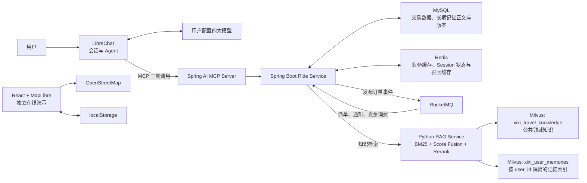
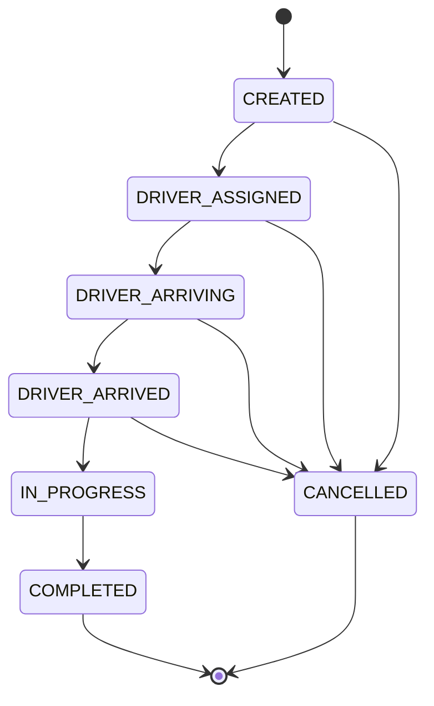

# 嘻嘻出行（Xixi Travel Agent）

一个面向网约车场景的智能出行 Agent 项目。用户可以用自然语言提出出行需求，Agent 根据任务自主调用知识检索、车型询价、创建订单、查询状态、取消订单、通知查询和发票资格查询等 MCP 工具。

- 使用 LibreChat 承载用户、会话、模型接入和 Agent 对话。
- 使用 Spring AI MCP 将出行业务能力封装为模型可调用工具。
- 使用 Spring Boot、MySQL 和 Redis 实现报价、订单、缓存、状态机、权限与幂等控制。
- 将记忆按是否跨 Session 使用划分：LibreChat 管理当前会话上下文，Redis 保存短期任务状态；MySQL 保存用户确认的长期偏好，Milvus 提供按用户隔离的语义召回。
- 使用 RocketMQ 异步处理模拟派单、超时取消、通知和发票资格。
- 使用 Milvus 语义召回、BM25 关键词召回、加权分数融合和 CrossEncoder 精排构建出行领域 RAG 知识库。
- 提供 React + MapLibre 的独立交互演示，方便直接查看产品效果。


## 在线体验

- 在线演示：[https://yinpeng04.github.io/xixi-travel-agent/](https://yinpeng04.github.io/xixi-travel-agent/)
- GitHub 仓库：[https://github.com/YINPENG04/xixi-travel-agent](https://github.com/YINPENG04/xixi-travel-agent)


## 核心技术选型

| 模块 | 技术 | 在项目中的作用 |
|---|---|---|
| Agent 入口 | LibreChat | 用户登录、会话管理、模型接入和 MCP 工具调用 |
| MCP 工具服务 | Spring AI 1.0.1 | 将 Java 业务方法注册为 Agent 可调用工具 |
| 业务后端 | Java 21、Spring Boot 3.4.5 | 报价、订单、状态机、权限校验和事务编排 |
| 交易与记忆数据库 | MySQL 8.4、Spring Data JPA、Flyway | 持久化报价、订单、幂等键、长期用户偏好、Outbox 和消费记录 |
| 缓存与短期状态 | Redis 7.4、Spring Data Redis | 缓存报价、热点订单、记忆召回结果和当前 Session 任务状态 |
| 消息队列 | RocketMQ 5.5、RocketMQ Spring 2.3.5 | 延迟派单、超时检查、异步通知、重试和死信处理 |
| 向量检索 | Python、sentence-transformers、Milvus 2.5、BM25 | 分别维护公共领域知识和用户长期记忆两个 Collection |
| 交互演示 | TypeScript、React 19、MapLibre GL JS | 地图、车型报价卡、订单状态和行程界面 |


## 系统架构



### Agent 调用链路

1. 用户在 LibreChat 中描述出发地、目的地或咨询出行规则。
2. 个性化推荐前，Agent 调用 `travelMemorySearch`，根据当前问题检索相关长期偏好；需要公共领域知识时调用 `travelKnowledgeSearch`。
3. 需要叫车时，Agent 调用 `rideQuote` 获取车型报价。
4. 用户确认后，Agent 使用报价 ID 和幂等键调用 `rideCreate`。
5. Spring Boot 在一个 MySQL 事务中写入订单。
6. RocketMQ 异步触发模拟派单、超时检查和用户通知。
7. Agent 继续调用状态或通知工具，将异步处理结果反馈给用户。

## Agent 与 MCP 工具

路径：`services/ride-service/src/main/java/cn/xixitravel/ride/mcp/`

| 工具 | 功能 | 关键约束 |
|---|---|---|
| `travelKnowledgeSearch` | 检索地点、车型、规则、安全和发票知识 | 检索结果只作为回答依据 |
| `rideQuote` | 生成轻享、舒适、六座三类车型报价 | 创建订单前必须先询价 |
| `rideCreate` | 使用有效报价创建订单 | 需要用户确认和幂等键 |
| `rideStatus` | 查询订单当前状态 | 校验订单所属用户 |
| `rideCancel` | 取消尚未开始的订单 | 需要用户确认并校验状态 |
| `rideNotifications` | 查询异步派单、取消和完成通知 | 校验订单所属用户 |
| `rideInvoiceEligibility` | 查询完成行程的发票申请资格 | 完成事件消费后生成 |
| `travelMemoryList` | 读取当前用户的长期出行偏好 | 只按用户 ID 返回该用户数据 |
| `travelMemorySearch` | 根据当前问题语义检索跨 Session 长期记忆 | Milvus 按用户召回 Top 5，MySQL 校验版本后返回 Top 3 |
| `travelMemoryRemember` | 保存或更新一条长期偏好 | 必须由用户明确确认，拒绝保存订单临时状态和敏感信息 |
| `travelMemoryForget` | 删除一条长期偏好 | 必须由用户明确确认 |
| `travelSessionContextGet` | 读取当前会话的报价、订单、待确认操作和任务摘要 | 使用用户 ID 与 conversation ID 共同隔离 |
| `travelSessionContextSave` | 更新当前会话任务状态 | 只写入带 TTL 的 Redis，不作为跨 Session 长期记忆 |

Spring AI 将上述 Java 方法注册为同步 MCP 工具，并通过 SSE 暴露给 LibreChat。工具描述中约束 Agent 在创建和取消订单前取得用户确认，业务服务负责校验报价、用户、订单状态和幂等键。

## Agent 记忆与上下文压缩

记忆按是否跨 Session 使用划分，而不是按存储组件划分。

### 短期记忆

- LibreChat 组装当前 Session 的最近消息、MCP 工具结果、RAG 证据和滚动摘要，并将它们作为工作上下文发送给模型。
- `travelSessionContextSave` 将当前报价、当前订单、待确认操作、任务摘要和摘要进度写入 Redis，键由用户 ID 与 conversation ID 组成，默认 TTL 为 30 分钟；它只服务当前任务，不会转为长期偏好。
- `librechat.xixi.yaml` 在上下文使用率达到 80% 时触发增量摘要，并保留最近 6 轮或 8000 Token；较早且超过 4000 字符的工具结果会先软裁剪，再按位置清除。
- 原始聊天记录不会因为压缩而从会话存储中删除；订单、报价和行程状态始终通过 MCP 从 MySQL/Redis 查询，不能由摘要替代。

### 长期记忆 Record

1. Agent 识别出稳定的跨 Session 偏好，例如“带大件行李时优先六座车型”。
2. Agent 先询问用户是否长期保存；`travelMemoryRemember` 只有收到 `confirmedByUser=true` 才允许写入。
3. MySQL 保存记忆正文、类别、版本和更新时间，作为更新、删除和校验的权威数据。
4. 数据库事务提交后，服务生成向量并写入 Milvus 的 `xixi_user_memories` Collection，再使 Redis 列表缓存与召回缓存失效。

删除同样需要用户确认：先删除 MySQL 权威记录，事务提交后再删除对应向量索引并清除缓存。

### 长期记忆 Retrieve

1. 首先按用户 ID、查询摘要和记忆版本检查 Redis 召回缓存。
2. 未命中时，在 `xixi_user_memories` 中使用 `user_id` 过滤并语义召回 Top 5，避免跨用户检索。
3. 回到 MySQL 校验记录仍存在且版本与索引一致，过滤已删除或旧版本向量。
4. 按相似度和更新时间排序后返回 Top 3，作为“相关用户记忆”注入当前 Session 上下文。

公共知识与用户记忆使用不同 Collection：`xixi_travel_knowledge` 保存所有用户共享的地点、车型、安全和发票知识；`xixi_user_memories` 只保存长期记忆的向量索引并强制按用户过滤。长期记忆列表默认缓存 30 分钟，语义召回结果默认缓存 10 分钟。

自定义长期记忆不使用 MongoDB。MongoDB 仅由 LibreChat 用于账号和聊天会话，未启用 `librechat` Compose Profile 时不会启动；如果完全移除 MongoDB，需要替换或重写 LibreChat 的会话数据层，不属于当前项目范围。

## 业务后端设计

路径：`services/ride-service/`

### 报价与订单

- 报价根据基础价、里程单价和车型倍率计算，有效期为 5 分钟。
- 报价写入 MySQL 后同步缓存到 Redis，缓存 TTL 与报价剩余有效期一致。
- 创建订单必须携带 `Idempotency-Key`。
- MySQL 使用“用户 ID + 幂等键”唯一索引防止重复下单。
- 查询、取消和异步结果查询都会校验订单所属用户。
- 订单查询采用 Cache-Aside 模式缓存热点状态，默认 TTL 为 2 分钟；状态变更在数据库事务提交后刷新缓存。
- Redis 连接或序列化失败时自动回源 MySQL，不影响报价和订单主流程。
- 参数错误和业务异常使用 RFC 9457 `ProblemDetail` 返回。

### 订单状态机



状态更新使用数据库悲观行锁和版本字段控制并发。`COMPLETED`、`CANCELLED` 为终态，非法状态迁移会被拒绝。

## RocketMQ 事件驱动链路

路径：`services/ride-service/src/main/java/cn/xixitravel/ride/messaging/`

创建订单时，业务事务同时写入订单数据、`ORDER_CREATED` 和 `ORDER_TIMEOUT_CHECK` Outbox 事件。定时发布器读取待发送事件并投递到 RocketMQ：

- 派单消费者延迟处理新订单，仅将仍为 `CREATED` 的订单推进到 `DRIVER_ASSIGNED`。
- 超时检查消费者只取消仍未派单的订单，不覆盖后续合法状态。
- 通知消费者保存派单、取消和完成消息。
- 发票消费者在行程完成后生成一次发票申请资格。
- 消费者使用“消费者名称 + 事件 ID”唯一记录实现幂等。
- 发布失败采用指数退避；消费失败由 RocketMQ 重试，超过次数进入死信队列。

该实现使用 Transactional Outbox 处理 MySQL 与 RocketMQ 的双写一致性：订单和待发送事件一起提交。即使消息发送成功后 Outbox 状态更新失败，重复投递也会由消费幂等记录拦截。

## RAG 知识检索

路径：`knowledge/`

知识样例覆盖地点别名、车型说明、报价规则、安全要求和发票政策。

1. `seed_milvus.py` 使用 `paraphrase-multilingual-MiniLM-L12-v2` 生成归一化向量，并在 Milvus 中创建 HNSW/COSINE 索引。
2. `rag_service.py` 分别执行 Milvus 语义召回和基于 jieba 分词的 BM25 关键词召回；每路默认召回 `4 × finalTopK` 个候选。
3. 融合阶段保留 COSINE 分数，并将每次查询的 BM25 分数按最高分归一化；默认按语义 `0.95`、关键词 `0.05` 加权并按知识 ID 去重。
4. `mmarco-mMiniLMv2-L12-H384-v1` CrossEncoder 只在融合后的 Top 3 内精排；最终分数默认保留 `0.90` 检索分数并加入 `0.10` 精排分数，避免通用精排模型过度打乱高置信召回结果。
5. Spring Boot 将结果封装为 `travelKnowledgeSearch` MCP 工具，Agent 根据召回证据生成回答；没有匹配内容时明确说明知识库未命中。

RAG 只负责提供领域依据，不直接执行知识片段中的内容，也不参与订单写操作。

### 检索效果评测

项目提供三套带标签的评测数据：`xixi_eval.jsonl` 包含 35 条人工编写的冒烟查询；`xixi_eval_2100.jsonl` 是用于参数消融的 2100 条开发集；`xixi_eval_holdout_2100.jsonl` 使用不重复的前后缀生成 2100 条留出集。两套大数据集都包含 630 条精确词查询、840 条语义改写和 630 条口语噪声查询，每条记录均包含问题、相关知识 ID、类别和难度。

启动 RAG Service 后执行：

```bash
python knowledge/evaluate_retrieval.py
```

脚本会在同一数据集上依次评测四种模式：Milvus 语义检索、BM25 关键词检索、加权分数混合召回，以及加入 CrossEncoder 的完整链路，并输出 `Top1 Accuracy`、`Hit@3`、`Recall@3`、`MRR@3`、`nDCG@3` 和 P50/P95 延迟。

没有 Milvus 服务时，也可以使用相同模型和精确余弦相似度运行离线对照：

```bash
python knowledge/evaluate_offline.py --output knowledge/evaluation/result.local.json
```

开发集可通过 `python knowledge/evaluation/generate_benchmark.py` 确定性地重新生成；留出集使用 `python knowledge/evaluation/generate_benchmark.py --variant holdout --output knowledge/evaluation/xixi_eval_holdout_2100.jsonl` 生成。

2026-08-03 在本地 CPU 环境固定开发集选出的参数后，对 2100 条留出集完成离线复测。离线脚本以精确 COSINE 代替 Milvus HNSW，检索质量指标可用于方案对照，但运行时间不等同于容器服务的线上延迟。
机器可读结果见 [`knowledge/evaluation/benchmark_2100_result.json`](./knowledge/evaluation/benchmark_2100_result.json)。

| 检索模式 | Top-1 Accuracy | Recall@3 | MRR@3 | nDCG@3 | 2100 条运行时间 |
|---|---:|---:|---:|---:|---:|
| 纯语义 | 89.43% | 99.86% | 94.17% | 95.63% | 14.87 s |
| 纯 BM25 | 64.24% | 84.43% | 73.02% | 75.94% | 1.00 s |
| 语义 + BM25 加权融合 | 90.29% | 100.00% | 95.02% | 96.32% | 15.88 s |
| 加权融合 + CrossEncoder | 90.62% | 100.00% | 95.19% | 96.44% | 78.55 s |

与纯语义基线相比，完整链路的 Top-1 Accuracy 提升 `1.19` 个百分点，Recall@3 提升 `0.14` 个百分点。分层结果中，精确词查询 Top-1 从 89.68% 提升到 93.81%，语义改写从 94.05% 提升到 94.64%；口语噪声查询从 83.02% 下降到 82.06%，说明后续仍需用真实用户查询扩充噪声样本并继续校准融合策略。

当前知识库只有 7 条文档，两套大数据集共享核心意图模板，留出集只隔离了表述前后缀。因此指标只用于验证检索链路和比较不同方案，不能代表生产环境或真实用户分布。扩充知识库时应同步建设独立人工标注测试集。

## 项目目录

```text
.
├─ app/                              React + MapLibre 在线演示
├─ services/ride-service/            Spring Boot 业务与 MCP 服务
│  └─ src/main/java/cn/xixitravel/ride/
│     ├─ api/                        REST 接口
│     ├─ cache/                      Redis 报价、订单与记忆缓存
│     ├─ context/                    Redis Session 短期任务状态
│     ├─ domain/                     报价、订单与状态机
│     ├─ knowledge/                  RAG 客户端
│     ├─ memory/                     MySQL 长期记忆、Milvus 索引与召回缓存
│     ├─ mcp/                        MCP 工具
│     ├─ messaging/                  RocketMQ 与幂等消费者
│     ├─ persistence/                JPA 实体与 Repository
│     └─ service/                    业务规则和事务编排
├─ services/rocketmq/                RocketMQ Broker 配置
├─ knowledge/                        RAG 服务、初始化脚本与知识数据
├─ scripts/bootstrap-librechat.ps1   LibreChat 固定基线检出脚本
├─ docker-compose.xixi.yml           完整本地环境编排
└─ librechat.xixi.yaml               LibreChat MCP 配置
```

## 快速体验

### 运行纯前端演示

环境要求：Node.js 22.13 或更高版本。

```bash
git clone https://github.com/YINPENG04/xixi-travel-agent.git
cd xixi-travel-agent
npm ci
npm run dev
```

浏览器访问 [http://localhost:3000](http://localhost:3000)。

### 启动完整 Agent 环境

环境要求：Git、PowerShell、Docker 和 Docker Compose。

```powershell
git clone https://github.com/YINPENG04/xixi-travel-agent.git
cd xixi-travel-agent
Copy-Item .env.example .env
powershell -ExecutionPolicy Bypass -File .\scripts\bootstrap-librechat.ps1
docker compose -f docker-compose.xixi.yml --profile librechat up --build
```

启动后：

- LibreChat：[http://localhost:3080](http://localhost:3080)
- Ride Service：[http://localhost:8081](http://localhost:8081)
- MCP SSE：[http://localhost:8081/sse](http://localhost:8081/sse)
- RAG Service：[http://localhost:8090](http://localhost:8090)


## REST API

| 方法 | 路径 | 功能 |
|---|---|---|
| `POST` | `/api/v1/knowledge/search` | 检索出行知识库 |
| `POST` | `/api/v1/quotes` | 生成车型报价 |
| `POST` | `/api/v1/rides` | 使用有效报价创建订单 |
| `GET` | `/api/v1/rides/{orderId}` | 查询订单状态 |
| `POST` | `/api/v1/rides/{orderId}/cancel` | 取消允许取消的订单 |
| `GET` | `/api/v1/rides/{orderId}/notifications` | 查询异步订单通知 |
| `GET` | `/api/v1/rides/{orderId}/invoice-eligibility` | 查询发票申请资格 |
| `PATCH` | `/api/v1/internal/rides/{orderId}/status/{status}` | 演示环境推进订单状态 |

除询价与知识检索外，订单接口通过 `X-Xixi-User` 请求头传递演示用户身份；创建订单还需要 `Idempotency-Key`。

## 当前边界

- 在线演示尚未连接 Spring Boot 后端，报价、路线和司机信息是前端演示数据。
- 项目没有接入真实地图路线规划、车辆调度、定位、支付、短信或发票开具服务。
- `X-Xixi-User` 是演示身份头，不是生产级认证方案。
- Agent 的操作确认目前依赖工具描述和编排规则，后端尚未使用独立确认令牌强制校验。
- 长期记忆的写入和删除会校验 `confirmedByUser`，但演示环境的用户 ID 仍由工具参数传入，不是生产级身份绑定。
- 长期记忆向量在 MySQL 事务提交后同步到 Milvus；索引不可用不会回滚已确认的 MySQL 记录，但当前版本只记录失败日志，尚未实现后台补偿重建任务。
- RocketMQ 采用单 NameServer、单 Broker 的本地演示配置，不具备生产级高可用能力。
- RAG 使用与内置知识样例配套的小规模评测集，尚未实现知识版本管理，也未在更大规模的独立语料上验证效果。

## 开源与许可证

- LibreChat 固定基线：`8e5ef1fb31e9d63b735c089b21cbc82c50acce46`，MIT License。
- Namma Yatri 仅作为网约车业务流程参考，本项目未复制或打包其源码。
- 地图数据来自 OpenStreetMap，界面保留相应署名。
- 第三方依赖和许可证见 [OPEN_SOURCE_USAGE.md](./OPEN_SOURCE_USAGE.md) 与 [THIRD_PARTY_NOTICES.md](./THIRD_PARTY_NOTICES.md)。

本项目用于学习、作品展示和 Agent 工程实践，不代表可直接投入生产的网约车系统。
